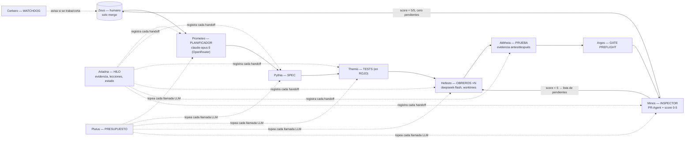

# Dédalo — Pipeline de Fábrica de Software con IA (v0.9)

Dédalo es un pipeline abierto de fábrica de software: pocas etapas con **entidades nombradas con la
mitología griega**, donde cada una produce un **artefacto** (nunca una promesa), y el cierre es un
**loop de revisión externa con puntaje**: el trabajo vuelve solo a los constructores hasta que el juez
da **5/5 con cero observaciones sin resolver**. Un humano (Zeus) es el único que puede hacer merge.

Nació de las lecciones de un protocolo de desarrollo multiagente en producción desde mediados de 2026,
inspirado en la software factory de Ras Mic (michaelshimeles/skills) y el podcast de Greg Isenberg.

> 🌐 Documentación completa en español (`docs/es/`) e inglés (`docs/en/`).
> 📐 Esquemas en `schemas/` (Mermaid, se renderizan en GitHub).
> 📦 Registro de entidades legible por máquina: `dedalo.entities.yaml`.

## El flujo en una imagen

## El elenco (¿por qué mitología griega?)

Cada entidad se nombra por el mito que coincide con su rol; los nombres griegos son neutros en idioma,
así los mismos identificadores sirven para la doc en español e inglés.

| Entidad | Mito | Rol en Dédalo | Modelo (por defecto) |
|---|---|---|---|
| Dédalo (Daedalus) | El artesano maestro de Creta | El pipeline mismo | — |
| Prometeo | El que piensa antes de actuar | **Planificador** — el único rol premium, escribe instrucciones claras para todas las demás etapas | `claude-opus-5` (Anthropic vía OpenRouter) |
| Pythia | El Oráculo de Delfos | Escribe la **spec** (la profecía a cumplir) | `deepseek-flash` |
| Themis | Diosa de la ley divina | **Tests**: escribe los tests que fallan (la ley) | `deepseek-flash` |
| Hefesto | Herrero de los dioses | **Obreros** — implementan en worktrees aislados | `deepseek-flash` |
| Alétheia | Diosa de la verdad revelada | **Prueba**: evidencia antes/después, assertions | sin LLM (scripts) |
| Minos | Juez de los muertos | **Inspector**: revisión externa, score 0-5, re-loop | PR-Agent + `deepseek-flash` |
| Argos (Panoptes) | El guardián de los cien ojos | **Gate de preflight** (plan, tests, doc, git) | sin LLM |
| Cerbero | El perro guardián de tres cabezas | **Watchdog**: avisos de traba/corte (Telegram) | sin LLM |
| Ariadna | El hilo en el laberinto | **Hilo**: rastro de evidencia + lecciones + estado reanudable | sin LLM (json/db) |
| Plutus | Dios de la riqueza | **Presupuesto**: topea cada llamada, 80% aviso, 100% corte | sin LLM |
| Zeus | Rey del Olimpo | **El humano** — el único autorizado a mergear | humano |

## Reglas no negociables (cada una es la cicatriz de una falla real)

1. **Evidencia, no intención** — cada etapa entrega un artefacto verificable (log crudo, tamaños,
   listado, score). "Funciona" nunca se acepta por palabra del agente.
2. **Nadie escribe en `main`** — cada unidad vive en su worktree y su rama (`agent/<unidad>`).
3. **Tests antes del código** — el RED se guarda como archivo; el test que falla es el contrato.
4. **Manda la spec** — si un test contradice la spec, se corrige el test con OK explícito y nota.
5. **Sin modelos pagos sin OK humano** — el presupuesto es tope, no sugerencia.
6. **Lo que corre no se toca** — cambios aditivos; la versión anterior sigue viva hasta que pasa el piloto.
7. **Reanudable + vigilado** — el trabajo largo persiste estado en disco, retoma donde cortó, y un
   watchdog avisa si se tranca.

## Documentación

| Tema | ES | EN |
|---|---|---|
| Arquitectura y etapas | [docs/es/architecture.md](docs/es/architecture.md) | [docs/en/architecture.md](docs/en/architecture.md) |
| El elenco (entidades) | [docs/es/entities.md](docs/es/entities.md) | [docs/en/entities.md](docs/en/entities.md) |
| Handoffs y contratos | [docs/es/handoffs.md](docs/es/handoffs.md) | [docs/en/handoffs.md](docs/en/handoffs.md) |
| Tests del pipeline | [docs/es/testing.md](docs/es/testing.md) | [docs/en/testing.md](docs/en/testing.md) |
| Capas anti-alucinación | [docs/es/anti-hallucination.md](docs/es/anti-hallucination.md) | [docs/en/anti-hallucination.md](docs/en/anti-hallucination.md) |
| Modelo de costos y modelo por rol | [docs/es/cost-model.md](docs/es/cost-model.md) | [docs/en/cost-model.md](docs/en/cost-model.md) |
| Roadmap 0.9 → 1.0 | [docs/es/roadmap.md](docs/es/roadmap.md) | [docs/en/roadmap.md](docs/en/roadmap.md) |

## Estado

**v0.9 — fundación.** Este repo documenta la arquitectura, entidades, contratos, tests, modelo de
costos y esquemas. El primer hito ejecutable es la **calibración del inspector** (ver
`docs/es/roadmap.md`). La v0.9 nació del plan en `/root/.hermes/plans/2026-09-18_pipeline-v2-inspector-externo.md`.

## Licencia

MIT — © 2026 Antonio Rama. Inspirado en [michaelshimeles/skills](https://github.com/michaelshimeles/skills)
(partes MIT) y PR-Agent ([The-PR-Agent/pr-agent](https://github.com/The-PR-Agent/pr-agent), MIT).