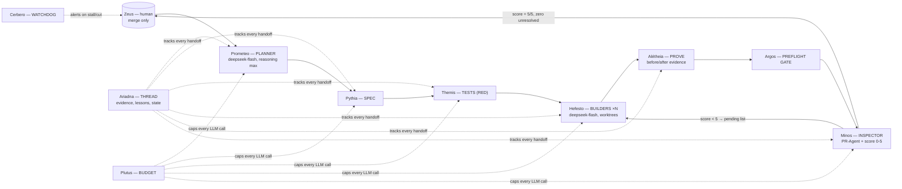

# Dédalo — AI Software Factory Pipeline (v0.9)

Dédalo is an open, model-agnostic software factory pipeline: a small set of stages with **named entities
from Greek mythology**, each producing an **artifact** (never a promise), ending in an external review
**score loop** where the work is sent back to the builders until the judge gives **5/5 with zero
unresolved findings**. A human (Zeus) is the only one who can merge.

Built from lessons learned running a multi-agent development protocol in production since mid-2026,
inspired by Ras Mic's software factory (michaelshimeles/skills) and Greg Isenberg's podcast.

> 🌐 Full docs in English (`docs/en/`) and Spanish (`docs/es/`).
> 📐 Schemas in `schemas/` (Mermaid, rendered inline on GitHub).
> 📦 Machine-readable entity registry: `dedalo.entities.yaml`.

## The flow in one picture

## The cast (why Greek names?)

Each entity is named after the myth that matches its role — Greek names are language-neutral,
so the same identifiers work in English and Spanish docs.

| Entity | Myth | Role in Dédalo | Model (default) |
|---|---|---|---|
| Dédalo (Daedalus) | The master craftsman of Crete | The pipeline itself | — |
| Prometeo | The Forethinker (who plans before acting) | **Planner** — writes clear instructions for every other stage | `deepseek-flash`, `thinking` + `reasoning_effort=max` *(A/B with `claude-opus-5` pending)* |
| Pythia | The Oracle of Delphi | Writes the **spec** (the prophecy to fulfill) | `deepseek-flash` |
| Themis | Goddess of divine law | **Tests**: writes failing tests (the law) | `deepseek-flash` |
| Hefesto (Hephaestus) | Blacksmith of the gods | **Builders** — implement in isolated worktrees | `deepseek-flash` |
| Alétheia | Goddess of revealed truth | **Prove**: before/after evidence, assertions | no LLM (scripts) |
| Minos | Judge of the dead | **Inspector**: external review, score 0-5, re-loop | PR-Agent + `deepseek-flash` |
| Argos (Panoptes) | The hundred-eyed guardian | **Preflight gate** (plan, tests, docs, git) | no LLM |
| Cerbero (Cerberus) | The three-headed watchdog | **Watchdog**: stall/cut alerts (Telegram) | no LLM |
| Ariadna | The thread through the labyrinth | **Thread**: evidence trail + lessons + resumable state | no LLM (json/db) |
| Plutus | God of wealth | **Budget**: caps every call, 80% warn, 100% stop | no LLM |
| Zeus | King of Olympus | **The human** — the only one allowed to merge | human |

## Non-negotiable rules (each is a scar from a real failure)

1. **Evidence, not intention** — every stage hands over a verifiable artifact (raw log, sizes, listing,
   score). "It works" is never accepted on the agent's word.
2. **No one writes to `main`** — every unit lives in its own worktree and branch (`agent/<unit>`).
3. **Tests before code** — the RED is saved as a file; the failing test is the contract.
4. **The spec wins** — if a test contradicts the spec, the test is fixed with explicit OK and a note.
5. **No paid models without human OK** — budgets are caps, never suggestions.
6. **Nothing that runs is touched** — changes are additive; the previous version stays alive until the
   pilot passes.
7. **Resumable + watched** — long work persists state to disk, retakes where it stopped, and a watchdog
   alerts if it stalls.

## Documentation

| Topic | EN | ES |
|---|---|---|
| Architecture & beats | [docs/en/architecture.md](docs/en/architecture.md) | [docs/es/architecture.md](docs/es/architecture.md) |
| The cast (entities) | [docs/en/entities.md](docs/en/entities.md) | [docs/es/entities.md](docs/es/entities.md) |
| Handoffs & contracts | [docs/en/handoffs.md](docs/en/handoffs.md) | [docs/es/handoffs.md](docs/es/handoffs.md) |
| Pipeline tests | [docs/en/testing.md](docs/en/testing.md) | [docs/es/testing.md](docs/es/testing.md) |
| Anti-hallucination layers | [docs/en/anti-hallucination.md](docs/en/anti-hallucination.md) | [docs/es/anti-hallucination.md](docs/es/anti-hallucination.md) |
| Cost model & model per role | [docs/en/cost-model.md](docs/en/cost-model.md) | [docs/es/cost-model.md](docs/es/cost-model.md) |
| Roadmap 0.9 → 1.0 | [docs/en/roadmap.md](docs/en/roadmap.md) | [docs/es/roadmap.md](docs/es/roadmap.md) |

## Status

**v0.9 — foundation.** This repo documents the architecture, entities, contracts, tests, cost model and
schemas. The first executable milestone is the **inspector calibration** (see `docs/en/roadmap.md`).
Version 0.9 was born from the plan in `/root/.hermes/plans/2026-09-18_pipeline-v2-inspector-externo.md`.

## License

MIT — © 2026 Antonio Rama. Inspired by [michaelshimeles/skills](https://github.com/michaelshimeles/skills)
(MIT parts) and PR-Agent ([The-PR-Agent/pr-agent](https://github.com/The-PR-Agent/pr-agent), MIT).