# Architecture

Dédalo v0.9 is a software factory: a fixed sequence of stages where **every transition is a handoff of
an artifact**, ending in a review loop with a numeric score. It is **model- and harness-agnostic** by
design: the only model-dependent stages are the four that call an LLM (plan, spec, tests, build,
inspect), and each declares its model so cost and quality are auditable per role.

## The four beats

1. **Isolate** — every unit starts in a fresh Git worktree branched from `origin/main`. Never build on
   `main`. Multiple agents work in parallel without stepping on each other.
2. **Build** — code follows a service-layer architecture: an orchestration layer owns the business
   rules ("why/when"), a service layer owns reusable mechanics ("how"), with explicit inputs and
   structured returns. Written so both humans and other agents can review it.
3. **Prove** — no prose claims. The unit carries before/after evidence: the failure reproduced **before**
   touching code, the working state **after**, an `assertions.md` with `passed / failed / untested +
   reason` per check, and the repo's checks green (`verify.sh`).
4. **Review (ship)** — the PR is opened with the evidence embedded. An **external inspector** (Minos,
   PR-Agent) reviews code it has never chatted about, returns **score 0–5 + a list of findings with
   file:line**. If score < 5 the unit **goes back to Build on its own** (the finding list is the spec of
   the next round), with a cap on iterations. At **5/5 with zero unresolved** the human (Zeus) is the
   only one who merges.

## State machine

```mermaid
stateDiagram-v2
    [*] --> spec
    spec --> red: Prometeo approves plan, Pythia writes spec
    red --> build: Themis writes failing tests (RED saved as file)
    build --> prove: Hefesto implements; verify.sh green
    prove --> review: Alétheia assembles before/after + assertions.md
    review --> build: score < 5 (pending list = next spec)
    review --> merge_pending: score = 5/5, zero unresolved
    merge_pending --> [*]: Zeus merges
    note right of review
        Minos = PR-Agent + deepseek-flash
        max iterations N (default 4)
        every round logged in Ariadna
    end note
```

## Entities and their artifacts

| Stage | Entity | Produces (artifact) |
|---|---|---|
| Plan | Prometeo | Plan: unit breakdown, effort, model choices, budget estimate |
| Spec | Pythia | `spec.md`: point-by-point prose, connected to what already exists |
| Tests | Themis | Failing tests + raw failure output (the RED, saved as file) |
| Build | Hefesto | Code in a worktree/branch `agent/<unit>`; tests green |
| Prove | Alétheia | before/after pair, `assertions.md`, verify.sh green |
| Gate | Argos | Preflight verdict (plan, tests, docs, git hygiene) |
| Inspect | Minos | Score 0–5 + findings list (file:line) + justification |
| Ledger | Ariadna | Per-unit log: iterations, scores, artifacts, lessons |
| Budget | Plutus | Spend, 80% warning, 100% hard cut |
| Watchdog | Cerbero | Alerts if a stage stalls or the run is cut |

## Multi-agent rules

- One worktree and one branch per task and per agent; never touch another agent's worktree, branch or
  uncommitted work.
- Scope check before starting: skim open PRs' changed files; on overlap, **stop and ask**.
- Never force-push to `main`; only `--force-with-lease` on your own task branch.
- Lockfile conflicts are resolved by regenerating, never by hand-merging.
- Worktrees don't isolate shared resources: confirm a dev-server port answers *your* process
  (`lsof -i :<port>`) before trusting it.
- If a conflict can't be resolved confidently: stop and report, don't guess.

## Operational guarantees

- **Resumable**: every unit persists state to disk (Ariadna) and retakes where it stopped.
- **Budgeted**: Plutus caps spend per run; 80% warn, 100% cut (Telegram).
- **Watched**: Cerbero runs on a timer; it alerts on completion, on cut, and on stall.
- **Additive**: the previous pipeline version stays alive until the pilot case passes; changes land in
  their own worktree and merge only after the gate.