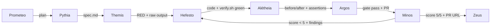

# Handoffs — how the baton is passed

Every stage transition is a **handoff of an artifact**, never a promise. The receiving stage validates
the artifact against the real destination; the next stage does not start until the validation passes.

## Handoff matrix

| From | To | Delivers (artifact) | Validated by |
|---|---|---|---|
| Zeus → Prometeo | Goal + constraints + budget | — | Prometeo checks the goal is parseable |
| Prometeo → Pythia | Plan (unit breakdown, effort, risks) | — | Pythia must be able to write a spec from it |
| Pythia → Themis | `spec.md` | Explicit statements of what must not break | Themis writes tests from it; contradictions go back with a note |
| Themis → Hefesto | Failing tests + raw failure output (RED file) | The runner actually runs them against the real destination | Hefesto's contract: turn them green, do not edit them |
| Hefesto → Alétheia | Code + verify.sh green + commit slices | Logs with sizes, listing of the destination | Alétheia runs the checks itself — nobody reports their own result |
| Alétheia → Argos | before/after evidence, `assertions.md`, checks green | Both halves exist and show the claimed change | Argos re-runs the cheap checks, verifies plan+docs+git hygiene |
| Argos → Minos | Branch pushed, PR with evidence embedded | PR URL, diff | Minos reads the real diff on the real PR |
| Minos → Hefesto | Score < 5 + findings list (file:line + what to fix) | The list **is** the spec of the next round | Orquestador requeues the unit; it never merges |
| Minos → Zeus | Score 5/5 + zero unresolved + PR URL + before/after | The human reads the evidence, not the code | Zeus merges or sends it back |

Every handoff also updates the **ledger (Ariadna)**: iteration number, score, artifacts, lessons — and
the **budget (Plutus)**: spend so far, 80% warn, 100% cut.

## Handoff rules

1. **Nobody is their own source.** "Done", "green", "works" are accepted only as raw artifact output
   validated by the receiving stage. (This is the "pinky promise" rule: agents can be pushed to lie, so
   they are never asked to certify.)
2. **One writer per file.** Only the owner of a worktree writes inside it; nobody edits another agent's
   branch or uncommitted work.
3. **No silent skips.** Any check that cannot run is `untested + reason` in `assertions.md` — visible,
   never silent.
4. **The spec wins over tests.** A test that contradicts the spec is fixed with explicit OK and a logged
   reason; the implementation is never bent to a wrong test.
5. **Stop and ask at two consecutive failures.** Pushing harder down a broken path is how days are lost.
6. **The merge is human.** No stage, gate or inspector can merge; only Zeus.

## Handoff diagram

## The three layers of every explanation (UI work)

When a handoff involves UI that the visitor edits, distinguish the three layers explicitly:

1. **What is seen** (label/question) — free text.
2. **The order** — drag & drop.
3. **What talks to the destination** (values/fields) — closed list, never hand-written by the visitor.