# Arquitectura

Dédalo v0.9 es una fábrica de software: una secuencia fija de etapas donde **cada transición es un
handoff con artefacto**, y que termina en un loop de revisión con puntaje numérico. Es **agnóstico de
modelo y de harness** por diseño: las únicas etapas dependientes de un modelo son las que llaman a un
LLM (planificar, spec, tests, construir, inspeccionar), y cada una declara su modelo, para que costo y
calidad sean auditables por rol.

## Las cuatro estaciones

1. **Aislar** — cada unidad arranca en un worktree de Git fresco, rama desde `origin/main`. Nunca se
   construye en `main`. Varios agentes trabajan en paralelo sin pisarse.
2. **Construir** — el código sigue una arquitectura en capas: una capa de orquestación dueña de las
   reglas de negocio ("por qué/cuándo") y una capa de servicios dueña de la mecánica reutilizable
   ("cómo"), con entradas explícitas y retornos estructurados. Escrito para que lo revise un humano y
   también otro agente.
3. **Probar (evidencia)** — se acabó la prosa: la unidad lleva evidencia
   antes/después: el fallo reproducido **antes** de tocar el código, el estado funcionando **después**,
   un `assertions.md` con `passed / failed / untested + motivo` por chequeo, y los checks del repo en
   verde (`verify.sh`).
4. **Revisar (y cerrar)** — el PR se abre con la evidencia embebida. Un **inspector externo** (Minos,
   PR-Agent) revisa código del que nunca conversó, y devuelve **score 0–5 + lista de observaciones con
   archivo:línea**. Si el score es < 5, la unidad **vuelve sola a Construir** (la lista de observaciones
   es la spec de la vuelta siguiente), con tope de iteraciones. Con **5/5 y cero pendientes**, el humano
   (Zeus) es el único que mergea.

## Máquina de estados

```mermaid
stateDiagram-v2
    [*] --> spec
    spec --> red: Prometeo aprueba el plan, Pythia escribe la spec
    red --> build: Themis escribe los tests que fallan (RED guardado como archivo)
    build --> prove: Hefesto implementa; verify.sh en verde
    prove --> review: Alétheia arma antes/después + assertions.md
    review --> build: score < 5 (la lista de pendientes = próxima spec)
    review --> merge_pending: score = 5/5, cero pendientes
    merge_pending --> [*]: Zeus mergea
    note right of review
        Minos = PR-Agent + deepseek-flash
        máximo N iteraciones (por defecto 4)
        cada vuelta queda registrada en Ariadna
    end note
```

## Entidades y sus artefactos

| Etapa | Entidad | Produce (artefacto) |
|---|---|---|
| Plan | Prometeo | Plan: desglose en unidades, esfuerzo, modelos, presupuesto estimado |
| Spec | Pythia | `spec.md`: prosa punto por punto, conectada con lo que ya existe |
| Tests | Themis | Tests que fallan + salida cruda del fallo (el RED, como archivo) |
| Construir | Hefesto | Código en worktree/rama `agent/<unidad>`; tests en verde |
| Probar | Alétheia | Par antes/después, `assertions.md`, verify.sh en verde |
| Gate | Argos | Veredicto de preflight (plan, tests, doc, higiene de git) |
| Inspeccionar | Minos | Score 0–5 + lista de observaciones (archivo:línea) + justificación |
| Bitácora | Ariadna | Log por unidad: iteraciones, scores, artefactos, lecciones |
| Presupuesto | Plutus | Gasto, aviso al 80%, corte duro al 100% |
| Watchdog | Cerbero | Avisos si una etapa se traba o la corrida se corta |

## Reglas multiagente

- Un worktree y una rama por tarea y por agente; nunca tocar el worktree, la rama o el trabajo sin
  commitear de otro agente.
- Scope check antes de arrancar: mirar los archivos que tocan los PRs abiertos; si hay solape,
  **parar y preguntar**.
- Nunca force-push a `main`; solo `--force-with-lease` en la rama propia de la tarea.
- Los conflictos de lockfile se resuelven regenerando, nunca mergeando a mano.
- Los worktrees no aíslan recursos compartidos: confirmar que el puerto del dev-server responde a *tu*
  proceso (`lsof -i :<puerto>`) antes de confiar en lo que sirve.
- Si un conflicto no se resuelve con confianza: parar y reportar, no adivinar.

## Garantías operativas

- **Reanudable**: cada unidad persiste estado en disco (Ariadna) y retoma donde cortó.
- **Con presupuesto**: Plutus topea el gasto por corrida; aviso al 80%, corte al 100% (Telegram).
- **Vigilado**: Cerbero corre por timer y avisa al terminar, al cortarse y al trabarse.
- **Aditivo**: la versión anterior del pipeline sigue viva hasta que pase el caso piloto; los cambios
  van en su worktree y se integran recién después del gate.