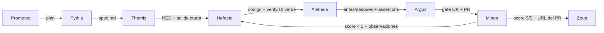

# Handoffs — cómo se pasa la posta

Cada transición de etapa es un **handoff con artefacto**, nunca una promesa. La etapa receptora valida
el artefacto contra el destino real; la etapa siguiente no arranca hasta que la validación pasa.

## Matriz de handoffs

| De | A | Entrega (artefacto) | Validado por |
|---|---|---|---|
| Zeus → Prometeo | Objetivo + restricciones + presupuesto | — | Prometeo chequea que el objetivo sea parseable |
| Prometeo → Pythia | Plan (desglose en unidades, esfuerzo, riesgos) | — | Pythia tiene que poder escribir una spec a partir de él |
| Pythia → Themis | `spec.md` | Declaraciones explícitas de qué no se puede romper | Themis escribe tests a partir de ella; las contradicciones vuelven con nota |
| Themis → Hefesto | Tests que fallan + salida cruda del fallo (archivo RED) | El runner los corre de verdad contra el destino real | El contrato de Hefesto: ponerlos en verde, no editarlos |
| Hefesto → Alétheia | Código + verify.sh en verde + commits por tramo | Logs con tamaños, listado del destino | Alétheia corre los checks ella misma — nadie reporta su propio resultado |
| Alétheia → Argos | Evidencia antes/después, `assertions.md`, checks en verde | Existen las dos mitades y muestran el cambio declarado | Argos re-corre los checks baratos, verifica plan+doc+higiene de git |
| Argos → Minos | Rama subida, PR con la evidencia embebida | URL del PR, diff | Minos lee el diff real en el PR real |
| Minos → Hefesto | Score < 5 + lista de observaciones (archivo:línea + qué corregir) | La lista **es** la spec de la vuelta siguiente | El orquestador re-encola la unidad; nunca la mergea |
| Minos → Zeus | Score 5/5 + cero pendientes + URL del PR + antes/después | El humano lee la evidencia, no el código | Zeus mergea o la devuelve |

Cada handoff también actualiza la **bitácora (Ariadna)**: número de iteración, score, artefactos,
lecciones — y el **presupuesto (Plutus)**: gasto hasta ahora, aviso al 80%, corte al 100%.

## Reglas de handoff

1. **Nadie es su propia fuente.** "Listo", "verde", "funciona" se aceptan solo como salida cruda del
   artefacto, validada por la etapa receptora. (Es la regla del "pinky promise": a los agentes se los
   puede empujar a mentir, por eso nunca se les pide que certifiquen.)
2. **Un solo escritor por archivo.** Solo el dueño de un worktree escribe dentro; nadie edita la rama o
   el trabajo sin commitear de otro agente.
3. **No hay saltos silenciosos.** Todo chequeo que no se puede correr es `untested + motivo` en
   `assertions.md` — visible, nunca callado.
4. **Manda la spec sobre los tests.** Un test que contradice la spec se corrige con OK explícito y
   motivo anotado; la implementación nunca se tuerce para acomodar un test equivocado.
5. **A los dos fallos seguidos: parar y preguntar.** Empujar más en la misma dirección rota es cómo se
   pierden los días.
6. **El merge es humano.** Ninguna etapa, gate ni inspector puede mergear; solo Zeus.

## Diagrama de handoffs

## Las tres capas de toda explicación (trabajo de UI)

Cuando un handoff involucra UI que edita el visitante, distinguir siempre las tres capas:

1. **Lo que se ve** (etiqueta/pregunta) — texto libre.
2. **El orden** — arrastrar.
3. **Lo que habla con el destino** (valores/campos) — lista cerrada, nunca escrita a mano por el visitante.